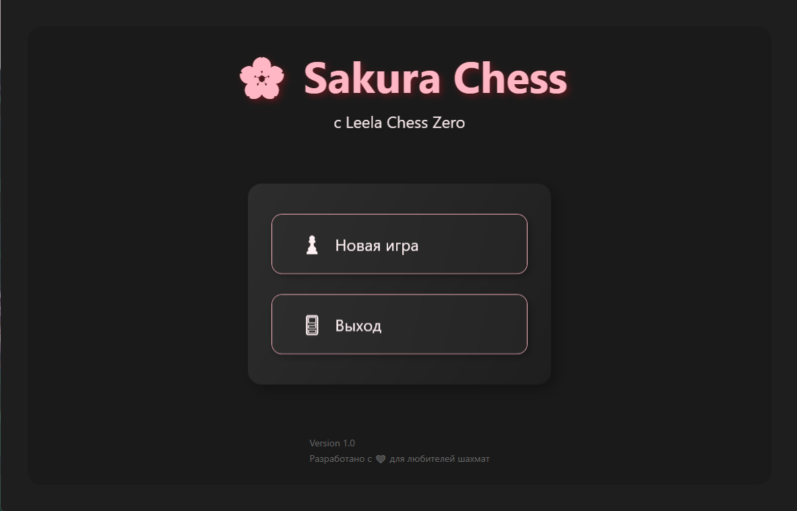
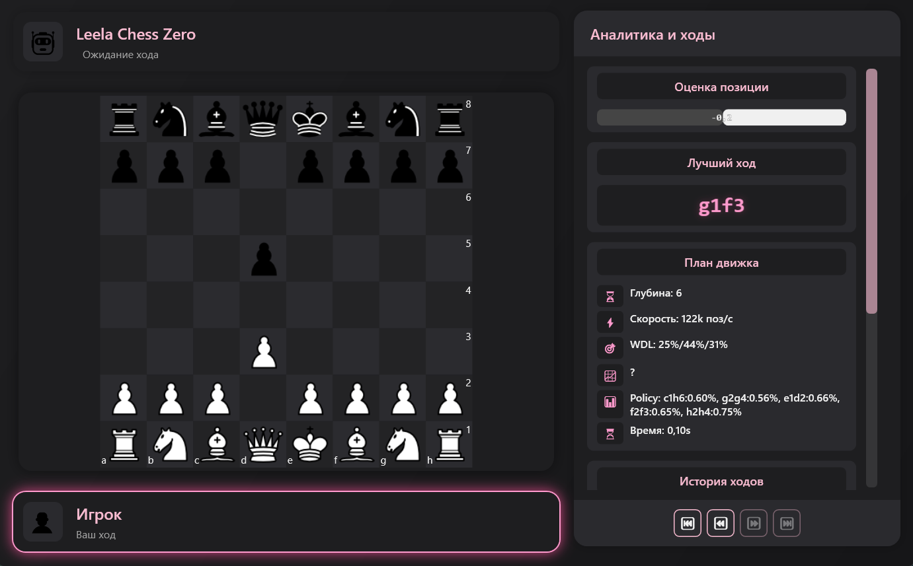
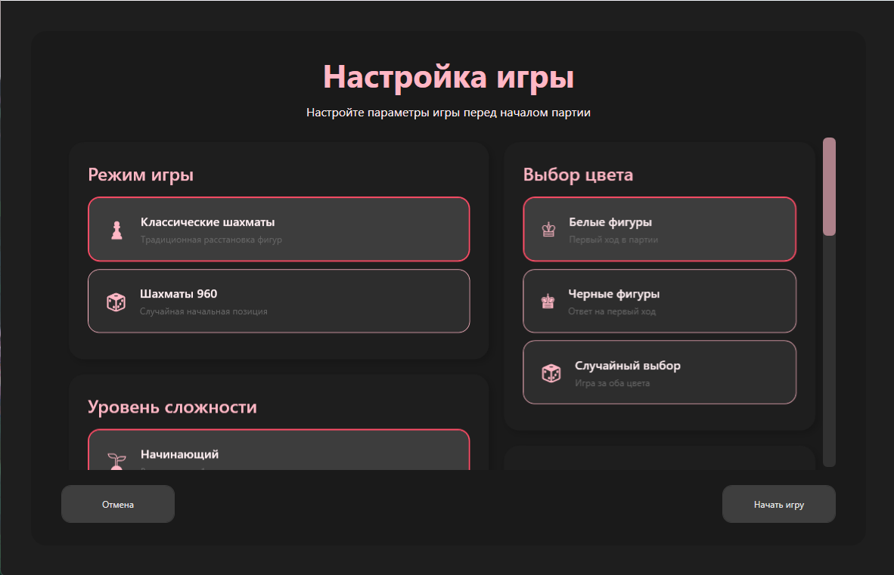

# 🌸 Sakura Chess

Красивое шахматное приложение на WPF с искусственным интеллектом на базе движка Lc0.


## ✨ Особенности

- 🎮 **Игра против ИИ** - Сражайтесь с мощным движком Lc0 на трех уровнях сложности
- 🎨 **Современный интерфейс** - Красивый дизайн в стиле Material Design с темной темой
- ⏱️ **Таймер** - Поддержка различных временных контролей (Bullet, Blitz, Rapid, Classical)
- 📊 **Анализ позиции** - Визуальная оценка позиции и лучшие ходы в реальном времени
- 📜 **История ходов** - Полная история партии с возможностью навигации
- 🎵 **Звуковые эффекты** - Приятные звуки при ходах и важных событиях
- 🎯 **Режимы игры**:
  - Классические шахматы
  - Chess960 (Fisher Random)
- 🎭 **Анимации** - Плавные анимации перемещения фигур
- 🔄 **Откат ходов** - Возможность отменить и повторить ходы

## 📸 Скриншоты

<div align="center">

### Главное меню


### Игровая доска


### Настройки игры


</div>

## 🚀 Установка

### Требования

- Windows 10/11 (x64)
- .NET 8.0 Runtime (устанавливается автоматически с установщиком)

### Скачать

Скачайте последнюю версию из раздела [Releases](https://github.com/D4cLoves/SacuraChess/releases).

Запустите `SakuraChessSetup.exe` и следуйте инструкциям установщика.

## 🎮 Как играть

1. Запустите приложение
2. Выберите режим игры (Classic или Chess960)
3. Настройте параметры:
   - Уровень сложности (Начинающий, Продвинутый, Эксперт)
   - Временной контроль
   - Цвет фигур (Белые, Черные, Случайный)
4. Нажмите "Начать игру"
5. Кликайте по фигурам, чтобы выбрать их, и по клеткам, чтобы сделать ход

## 🛠️ Разработка

### Требования для разработки

- Visual Studio 2022 или Rider
- .NET 8.0 SDK
- Windows SDK

### Сборка проекта

```bash
# Клонируйте репозиторий
git clone https://github.com/D4cLoves/SacuraChess.git
cd Lc-0_Chess

# Восстановите зависимости
dotnet restore

# Соберите проект
dotnet build --configuration Release

# Опубликуйте приложение
dotnet publish Lc-0_Chess/Lc-0_Chess.csproj -c Release -r win-x64 --self-contained false
```

### Структура проекта

```
Lc-0_Chess/
├── Lc-0_Chess/          # Основной проект
│   ├── Models/          # Модели данных и логика игры
│   ├── Views/           # WPF окна и UI
│   ├── Services/        # Сервисы (звук, таймер)
│   ├── Converters/      # Конвертеры для биндинга
│   └── Images/          # Изображения фигур
├── Lc-0_Chess.Tests/    # Юнит-тесты
├── Installer/            # Скрипты установщика Inno Setup
└── README.md
```

## 🧪 Тестирование

```bash
dotnet test
```

## 📦 Зависимости

- **MaterialDesignThemes** (5.2.1) - UI компоненты
- **Lc0** - Шахматный движок (включен в проект)

## 🤝 Вклад в проект

Вклад приветствуется! Пожалуйста:

1. Форкните репозиторий
2. Создайте ветку для новой функции (`git checkout -b feature/AmazingFeature`)
3. Закоммитьте изменения (`git commit -m 'Add some AmazingFeature'`)
4. Запушьте в ветку (`git push origin feature/AmazingFeature`)
5. Откройте Pull Request

## 📝 Лицензия

Этот проект распространяется под лицензией MIT. См. файл `LICENSE` для подробностей.

## 👤 Автор

**Vladik Aladik**

- GitHub: [@D4cLoves](https://github.com/D4cLoves)

## 🙏 Благодарности

- [Lc0](https://lczero.org/) - За отличный шахматный движок
- [Material Design In XAML Toolkit](https://github.com/MaterialDesignInXAML/MaterialDesignInXamlToolkit) - За красивые UI компоненты

## 📞 Поддержка

Если у вас возникли вопросы или проблемы, пожалуйста, создайте [Issue](https://github.com/D4cLoves/SacuraChess/issues).

---

⭐ Если вам нравится этот проект, поставьте звезду!

